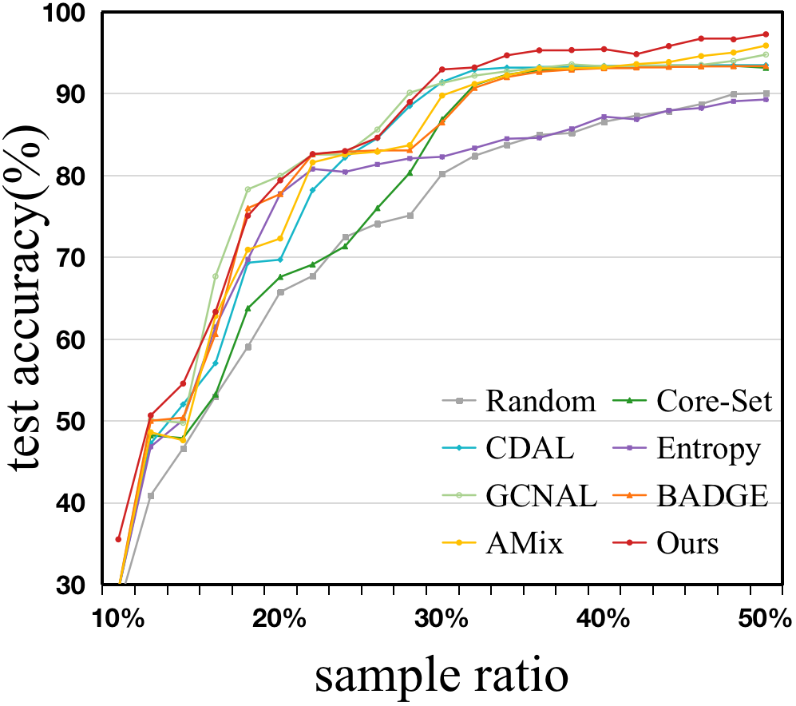
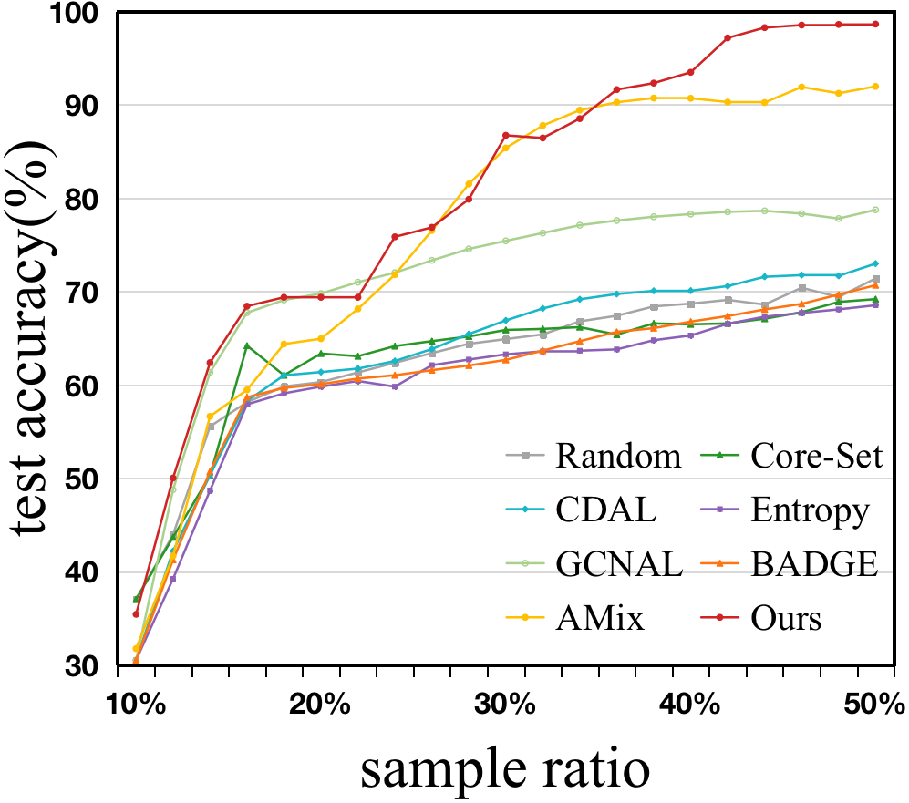

# AffectFAL

The Source code of AffectFAL: Federated Active Affective Computing with Non-IID data

The code is under cleaning.

Here are some experimental results to show.

The Acc on MEAD:

The Acc on AffectNet:

The Acc on SEED-V:

